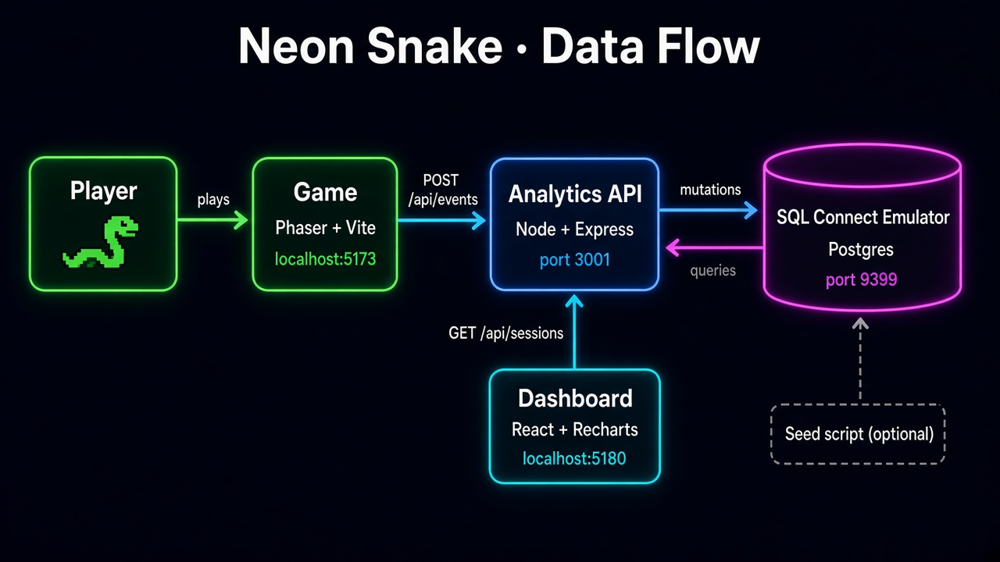

# Neon Snake

A compact browser game built with Phaser 3, TypeScript, Vite, and a DOM-based interface.

Gameplay analytics are stored by a local Node API. The API uses the Firebase Local Emulator Suite, so it does not need a real Firebase project or a service account.

## Gameplay

- Clear three increasingly fast levels.
- Eat the required number of fruit to advance.
- Avoid walls, your own trail, and level obstacles.
- Pause, resume, retry, or return to the main menu.
- Unlock levels, retain a best score, and restore mute preferences between sessions.
- Hear lightweight procedural sound effects without external audio assets.
- Play with arrow keys, WASD, swipe gestures, or the on-screen direction pad.

## 1. How to install and run the project

### Requirements

Node.js version 22 and latest pnpm is required. Since only local Firebase emulator has been used, there is no need to have Firebase account.

### Install and start

```bash
pnpm install:all
pnpm start
```

`pnpm install:all` installs the game, the backend, and the frontend. `pnpm start` runs everything in one terminal, with each log line prefixed by its part:

| Prefix | Part                            | Address                 |
| ------ | ------------------------------- | ----------------------- |
| `db`   | Database (SQL Connect emulator) | `127.0.0.1:9399`        |
| `api`  | Analytics API                   | `http://127.0.0.1:3001` |
| `game` | The game                        | `http://localhost:5173` |
| `dash` | Analytics dashboard             | `http://localhost:5180` |

To run only the game without analytics, use `pnpm dev`.

### Running each part on its own

Each command below runs one part. Start them in this order, each in its own terminal.

1. **Database emulator**

   ```bash
   pnpm emulators
   ```

The emulator listens on `127.0.0.1:9399`. Local database files stay in `dataconnect/.dataconnect/` and are not committed.

2. **Analytics API**

```bash
pnpm backend
```

The API runs on `http://127.0.0.1:3001` and sends events to the emulator. `backend/.env.example` shows the emulator settings. Copy it to `backend/.env` only if you need to change a port. With no `.env` file, the API still uses the emulator at `127.0.0.1:9399`.

3. **Game**

   ```bash
   pnpm dev
   ```

4. **Analytics dashboard**

   ```bash
   pnpm frontend
   ```

   Then open `http://localhost:5180`.

   You will see a single page frontend with meaningful data. I have used SQL Connect therefore, you can find the respective queries and mutations in:

   [`backend/src/repositories/gameplay.repository.ts`](backend/src/repositories/gameplay.repository.ts)

   I tried to come up with meaningul insights from the events that are emitted while playing the game. As charts, I have used the library recharts as I used it before in the company that I work. However, in the styling, I mostly used generative AI, which can be understood when it is examined.

### Sample data

To fill the emulator with 36 simulated sessions from the last four weeks, run this while the emulator is up:

```bash
pnpm --dir backend seed
```

The seed script refuses to run unless the API is pointed at the emulator.

### Checks and production build

```bash
pnpm check
pnpm build
pnpm preview
```

## 2. How to test the complete flow locally



The test follows one piece of data from start to end: you play the game, the game sends events to the API, the API stores them in the database, and the dashboard shows them.

### Step 1: Start everything

```bash
pnpm start
```

Wait until the terminal shows lines from all four parts (`db`, `api`, `game`, `dash`). The API prints `API listening on http://127.0.0.1:3001` when it is ready.

### Step 2: Play the game

Open `http://localhost:5173` and play a few runs. To get useful data, try to create each kind of ending:

- Finish level 1 (the run ends as **complete**).
- Hit a wall or yourself (the run ends as **fail**).
- Pause and choose **Exit to menu** (the run ends as **quit**, and the session ends).

### Step 3: See the events leave the game

Open the browser's developer tools and go to the **Network** tab. Every time something happens in the game, you will see a `POST /api/events` request:

| Game moment | Event sent |
| --- | --- |
| A run starts | `runStarted` |
| The snake eats fruit | `scoreChanged` and `progressChanged` |
| The run ends | `runEnded` |
| You leave to the menu or finish the game | `sessionEnded` |

A successful request returns status `201`. If the API rejects an event, the **Console** tab shows an error that starts with `[analytics]`.

### Step 4: See the data in the dashboard

Open `http://localhost:5180`. The runs you just played appear in:

- the overview numbers (sessions, runs, finish rate, best score),
- the "Outcomes by level" and "How far sessions get" charts,
- the recent sessions table at the bottom.

Play one more run and reload the dashboard. The numbers go up by one run.

### Step 5: Try it with more data (optional)

A few runs are not enough to make the charts interesting. While everything is running, add 36 sample sessions spread over the last four weeks:

```bash
pnpm --dir backend seed
```

Reload the dashboard and switch between **Last 7 days** and **Last 30 days**. The loader appears while the new range is loading, and the numbers change because the API only returns sessions that started inside the chosen range.

## 3. Main technical decisions

The main tech stack was already provided by you, therefore, I do not have a direct decision over there. The main decision I did was the usage of relational database, and the file structure within the application. I have used relational database because I saw that different events emitted during the game are connected to each other. There is a session, and within this session user can play more than one levels, and in each run there are different insights. If I used a NoSQL system, then the documents in the collection would be out of control and getting meaningful data out of it would be amazingly hard.

I tried to be modular in the folder structure to have a more scalable application. Currently, undoubtedly, it can be improved. However, within 6 hours, I gave my best to modularize both the frontend and backend. Since there is no state-management requirement as this is only to provide a dashboard, I have not implemented a state-management and authentication.

## 4. Assumptions and known limitations

### Assumptions

- I assumed there is one player per browser tab. A new session starts when the player starts their first run, and it ends when they finish the game or go back to the menu.
- I assumed players do not need an account. Every session gets a random id, so I cannot tell if the same person comes back tomorrow.
- I assumed a local setup is enough for this challenge. Everything runs on the Firebase emulator, so no real cloud project is needed.

### Known limitations

- When the player closes the tab, the game tries to send a last "quit" event. The browser does not always let this finish, so some sessions may look like they never ended.

- Anyone can send data to `POST /api/events`, not only the game.

## 5. What I would improve with more time

To demonstrate my skills in frontend section more, I could create different Scenes in the application and have a store with Zustand to ensure the state management through scenes or components.

I would come up with a better database along with a proper ER Diagram to increase the amount of the meaningful insights. However, I would stick with the decision of SQL as data has excessive relations among each other.

An E2E test could be developed using Cypress to check whether the application is production-ready or not.

Right now, anyone can send events to `POST /api/events`. I can add rate limiting to stop spam, give the game a signed token so only real game sessions are accepted, and block requests from other websites.

## Project structure

```text
src/
├── application/
│   ├── GameController.ts
│   └── gameEvents.ts
├── core/
│   ├── audio/
│   │   └── GameAudio.ts
│   ├── events/
│   │   └── EventBus.ts
│   └── storage/
│       └── GameStorage.ts
├── game/
│   ├── input.ts
│   ├── levels.ts
│   ├── scenes/
│   │   └── SnakeScene.ts
│   ├── snakeGame.ts
│   └── types.ts
├── main.ts
└── style.css
```
